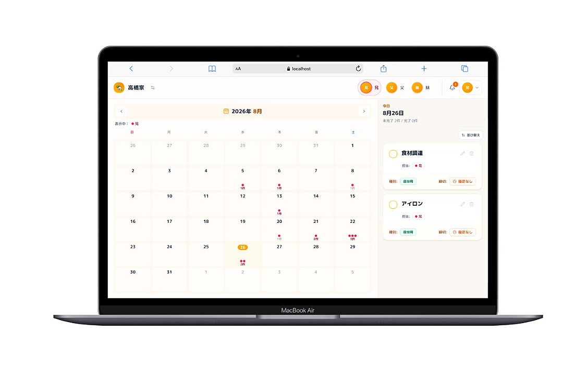
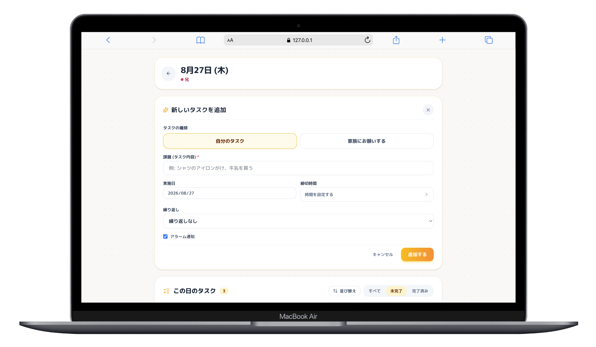
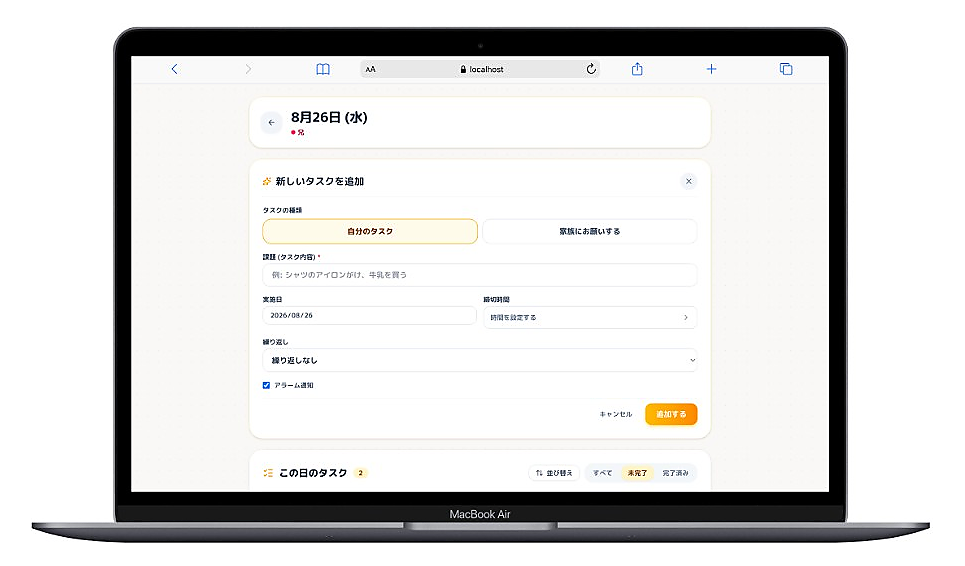
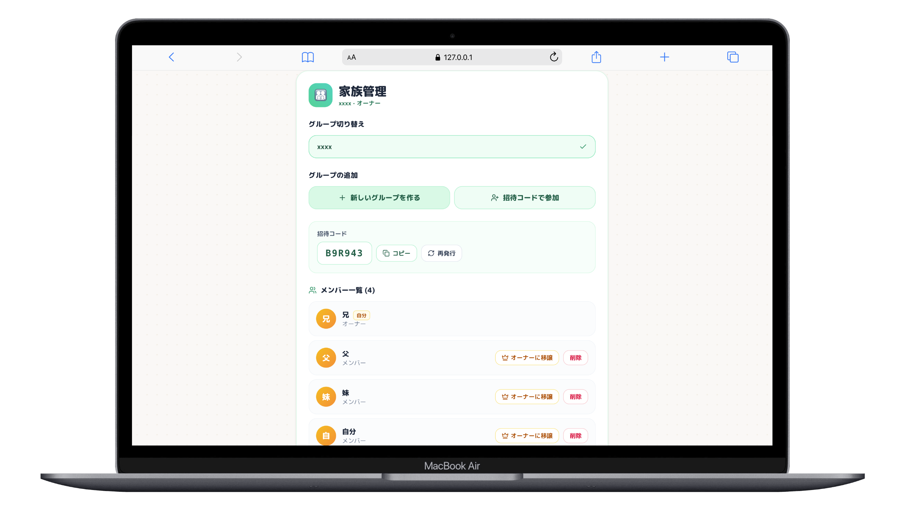
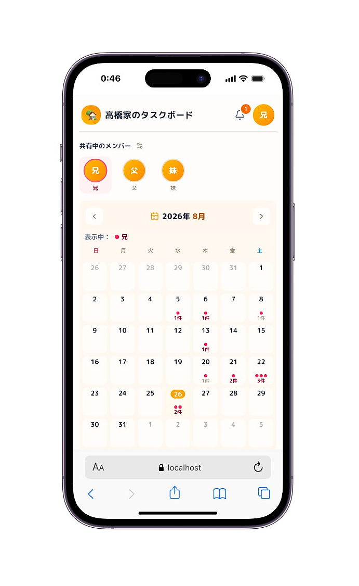
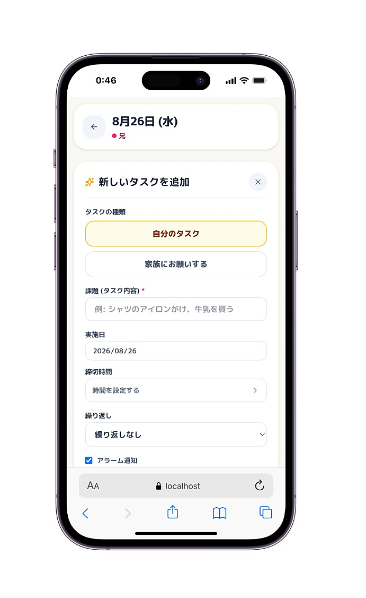
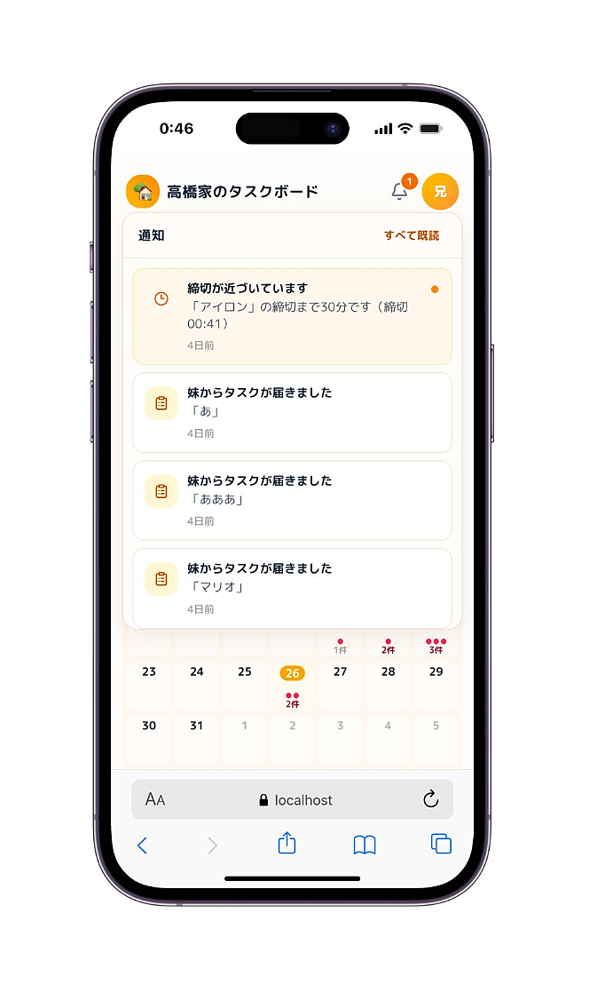
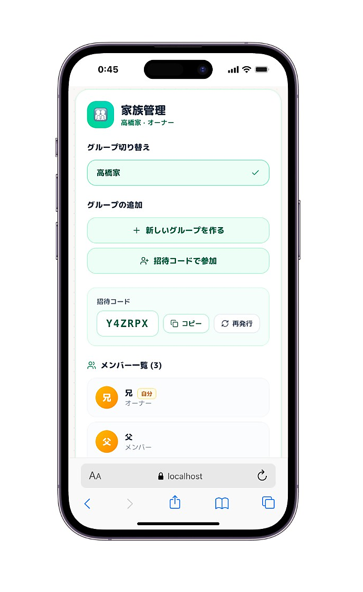

# FamilyTask

家族向け共有タスク管理アプリです。  
カレンダーで「誰が・何を・いつまでに」を共有し、リアルタイム同期とアプリ内通知で進捗を追いかけられます。

---

## アプリケーション概要

FamilyTask は、家庭内のタスクをメンバー同士で依頼・完了できる Web アプリです。

家族内のタスクを、誰が・いつまでに行うのかを分かりやすく共有できるように制作しました。

- グループ（家族）単位でのタスク共有
- カレンダー上でのタスク管理・依頼・完了
- 依頼・完了・締切接近のアプリ内通知
- 複数端末でのリアルタイム反映
- PC / スマホ対応 UI

---

## 主な機能

| 機能 | 内容 |
| --- | --- |
| 認証 | Firebase Authentication（メール / パスワード） |
| プロフィール | 表示名・アバター（GCS 署名 URL） |
| グループ管理 | 作成 / 招待コード参加 / 切替 / 退出 / 削除 / 所有権移譲。複数グループ所属に対応 |
| カレンダー・タスク | 月表示・日別表示。自分用タスクと家族への依頼、担当者・締切・完了・並び替え |
| 繰り返しタスク | 日 / 週 / 月 / 年単位。シリーズ削除（単発 / 以降 / 全体）に対応 |
| 通知 | 依頼・完了・締切約30分前のアプリ内通知。既読 / 全既読 |
| リアルタイム同期 | Laravel Reverb により、タスク・メンバー・通知を複数端末へ即時反映 |

---

## 技術スタック

| 区分 | 技術 |
| --- | --- |
| フロントエンド |     |
| バックエンド |   |
| ログイン |  |
| データベース |  |
| プロフィール画像 |  |
| リアルタイム通信 |  |
| 開発ツール |   |

---

## アプリの画面

### PC

| メイン画面（カレンダー） | タスク作成 |
| :---: | :---: |
|  |  |
| 通知 | グループ・メンバー管理 |
|  |  |

### スマホ

| メイン画面（カレンダー） | タスク作成 |
| :---: | :---: |
|  |  |
| 通知 | グループ・メンバー管理 |
|  |  |

---

## ローカル起動

### 前提

- Node.js / npm
- PHP 8.3+ / Composer
- Firebase プロジェクト（Authentication・Firestore）
- Firebase Admin SDK のサービスアカウント JSON
- （任意）GCS バケット — プロフィール画像用
- （任意）締切接近通知用にスケジューラ実行

### 1. フロントエンド

```bash
cp .env.local.example .env.local
# Firebase Web SDK / API URL / Reverb の公開設定を記入

npm install
npm run dev
# http://localhost:3000
```

### 2. API

```bash
cd api
cp .env.example .env
# APP_KEY, GOOGLE_APPLICATION_CREDENTIALS, FIREBASE_STORAGE_BUCKET,
# REVERB_* などを記入

composer install
php artisan key:generate
touch database/database.sqlite
php artisan migrate

php artisan serve          # http://127.0.0.1:8000
php artisan reverb:start   # WebSocket :8087
```

締切接近通知を使う場合:

```bash
php artisan schedule:work
```

### 環境変数のポイント

| ファイル | 主な項目 |
| --- | --- |
| `.env.local` | `NEXT_PUBLIC_FIREBASE_*` / `NEXT_PUBLIC_API_BASE_URL` / `NEXT_PUBLIC_REVERB_*` |
| `api/.env` | `GOOGLE_APPLICATION_CREDENTIALS` / `FIREBASE_STORAGE_BUCKET` / `REVERB_*` / `BROADCAST_CONNECTION=reverb` |

`FIREBASE_STORAGE_BUCKET` は GCS のバケット名です（Firebase Web SDK の `*.appspot.com` とは別）。

---

## 今後の展望

- Push通知の実装
- 通知設定のカスタマイズ
- タスク検索機能
